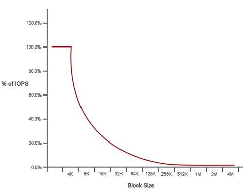

= Performance et qualité du service
:allow-uri-read: 
:icons: font
:imagesdir: ../media/

[role="lead"]
Un cluster de stockage SolidFire a la capacité de fournir des paramètres de qualité de service (QoS) par volume.  Vous pouvez garantir les performances du cluster mesurées en entrées et sorties par seconde (IOPS) à l'aide de trois paramètres configurables qui définissent la QoS : IOPS min, IOPS max et IOPS en rafale.

NOTE: SolidFire Active IQ dispose d'une page de recommandations QoS qui fournit des conseils sur la configuration et le paramétrage optimaux des paramètres QoS.

== Paramètres de qualité de service

Les paramètres IOPS sont définis de la manière suivante :

* *IOPS minimum* - Le nombre minimum d'entrées et de sorties soutenues par seconde (IOPS) que le cluster de stockage fournit à un volume.  Le nombre minimal d'IOPS configuré pour un volume correspond au niveau de performance garanti pour ce volume.  Les performances ne descendent pas en dessous de ce niveau.
* *IOPS maximales* - Le nombre maximal d'IOPS soutenues que le cluster de stockage fournit à un volume.  Lorsque les niveaux d'IOPS du cluster sont extrêmement élevés, ce niveau de performance IOPS n'est pas dépassé.
* *IOPS en rafale* - Le nombre maximal d'IOPS autorisés dans un scénario de rafale courte.  Si un volume a fonctionné en dessous du nombre maximal d'IOPS, des crédits de rafale sont accumulés.  Lorsque les niveaux de performance deviennent très élevés et sont poussés à leurs niveaux maximums, de courtes rafales d'IOPS sont autorisées sur le volume.
+
Le logiciel Element utilise les IOPS en rafale lorsqu'un cluster fonctionne dans un état de faible utilisation des IOPS du cluster.

+
Un seul volume peut accumuler des IOPS en rafale et utiliser ces crédits pour dépasser ses IOPS maximales jusqu'à son niveau d'IOPS en rafale pendant une « période de rafale » définie.  Un volume peut exploser pendant une durée maximale de 60 secondes si le cluster a la capacité de supporter cette explosion.  Un volume accumule une seconde de crédit de rafale (jusqu'à un maximum de 60 secondes) pour chaque seconde pendant laquelle le volume fonctionne en dessous de sa limite Max IOPS.

+
Les IOPS en rafale sont limitées de deux manières :

+
** Un volume peut dépasser son nombre maximal d'IOPS pendant un nombre de secondes égal au nombre de crédits de rafale accumulés par le volume.
** Lorsqu'un volume dépasse son paramètre Max IOPS, il est limité par son paramètre Burst IOPS.  Par conséquent, les IOPS en rafale ne dépassent jamais le paramètre IOPS en rafale défini pour le volume.

* *Bande passante maximale effective* - La bande passante maximale est calculée en multipliant le nombre d'IOPS (basé sur la courbe QoS) par la taille des E/S.
+
Exemple : Les paramètres QoS suivants : 100 IOPS min., 1 000 IOPS max. et 1 500 IOPS en rafale, ont les effets suivants sur la qualité des performances :

+
** Les charges de travail peuvent atteindre et maintenir un maximum de 1000 IOPS jusqu'à ce que la situation de contention des charges de travail pour les IOPS devienne apparente sur le cluster.  Les IOPS sont ensuite réduites progressivement jusqu'à ce que les IOPS sur tous les volumes se situent dans les plages QoS désignées et que la contention des performances soit soulagée.
** Les performances sur tous les volumes sont optimisées pour atteindre le seuil minimal d'IOPS de 100.  Les niveaux ne descendent pas en dessous du seuil minimal d'IOPS, mais peuvent rester supérieurs à 100 IOPS lorsque la contention de la charge de travail est soulagée.
** Les performances ne dépassent jamais 1000 IOPS, ni ne sont inférieures à 100 IOPS de manière prolongée.  Une performance de 1500 IOPS (IOPS en rafale) est autorisée, mais uniquement pour les volumes qui ont accumulé des crédits de rafale en fonctionnant en dessous du nombre maximal d'IOPS et seulement pendant de courtes périodes.  Les pics de consommation ne sont jamais maintenus.

== limites de valeur QoS

Voici les valeurs minimales et maximales possibles pour la QoS.

[cols="7*"]
|===
| Paramètres | Valeur minimale | Défaut | 4 4KB | 5 8 Ko | 6 16 Ko | 262 Ko 

| IOPS minimales | 50 | 50 | 15 000 | 9 375* | 5556* | 385* 

| IOPS max | 100 | 15 000 | 200 000** | 125 000 | 74 074 | 5128 

| IOPS en rafale | 100 | 15 000 | 200 000** | 125 000 | 74,074 | 5128 
|===
*Ces estimations sont approximatives.  **Les valeurs maximales d'IOPS et d'IOPS en rafale peuvent être fixées à 200 000 ; toutefois, ce paramètre n'est autorisé que pour débloquer les performances d'un volume.  Les performances maximales réelles d'un volume sont limitées par l'utilisation du cluster et les performances de chaque nœud.

== performances QoS

La courbe de performance QoS illustre la relation entre la taille des blocs et le pourcentage d'IOPS.

La taille des blocs et la bande passante ont un impact direct sur le nombre d'IOPS qu'une application peut obtenir.  Le logiciel Element tient compte de la taille des blocs qu'il reçoit en normalisant cette taille à 4k.  En fonction de la charge de travail, le système peut augmenter la taille des blocs. À mesure que la taille des blocs augmente, le système accroît sa bande passante au niveau nécessaire pour traiter ces blocs plus volumineux.  À mesure que la bande passante augmente, le nombre d'IOPS que le système est capable d'atteindre diminue.

La courbe de performance QoS illustre la relation entre l'augmentation de la taille des blocs et la diminution du pourcentage d'IOPS :

Par exemple, si la taille des blocs est de 4k et la bande passante de 4000 KBps, les IOPS sont de 1000.  Si la taille des blocs passe à 8 ko, la bande passante passe à 5000 Ko/s et les IOPS diminuent à 625.  En tenant compte de la taille des blocs, le système garantit que les charges de travail de priorité inférieure qui utilisent des tailles de blocs plus importantes, telles que les sauvegardes et les activités de l'hyperviseur, n'accaparent pas une trop grande partie des performances nécessaires au trafic de priorité supérieure utilisant des tailles de blocs plus petites.

== Politiques QoS

Une politique QoS vous permet de créer et d'enregistrer un paramètre de qualité de service standardisé qui peut être appliqué à de nombreux volumes.

Les politiques QoS sont idéales pour les environnements de services, par exemple avec des serveurs de bases de données, d'applications ou d'infrastructure qui redémarrent rarement et nécessitent un accès constant et égal au stockage.  La QoS de volume individuel est idéale pour les VM à faible utilisation, telles que les bureaux virtuels ou les VM spécialisées de type kiosque, qui peuvent être redémarrées, allumées ou éteintes quotidiennement ou plusieurs fois par jour.

La QoS et les politiques QoS ne doivent pas être utilisées simultanément.  Si vous utilisez des politiques QoS, n'utilisez pas de QoS personnalisée sur un volume.  La QoS personnalisée remplacera et ajustera les valeurs de stratégie QoS pour les paramètres QoS de volume.

NOTE: Le cluster sélectionné doit être Element 10.0 ou une version ultérieure pour utiliser les politiques QoS ; sinon, les fonctions de politique QoS ne sont pas disponibles.

== Trouver plus d'informations

* https://docs.netapp.com/us-en/element-software/index.html["Documentation logicielle SolidFire et Element"]

