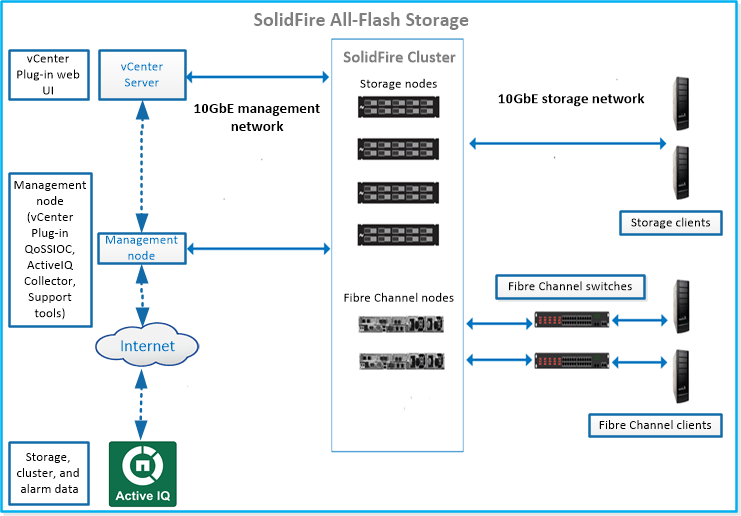

= Découvrez l'architecture SolidFire
:allow-uri-read: 
:icons: font
:imagesdir: ../media/

[role="lead"]
Un système de stockage 100% flash SolidFire est composé de composants matériels discrets (disques et nœuds) combinés en un pool de ressources de stockage avec le logiciel NetApp Element fonctionnant indépendamment sur chaque nœud.  Ce système de stockage unique est géré comme une entité unique à l'aide de l'interface utilisateur, de l'API et d'autres outils de gestion du logiciel Element.

Un système de stockage SolidFire comprend les composants matériels suivants :

* *Cluster* : Le centre névralgique du système de stockage SolidFire , constitué d’un ensemble de nœuds.
* *Nœuds* : Les composants matériels regroupés en cluster.  Il existe deux types de nœuds :
+
** Les nœuds de stockage sont des serveurs contenant un ensemble de disques.
** Les nœuds Fibre Channel (FC), que vous utilisez pour vous connecter aux clients FC

* *Disques durs* : Utilisés dans les nœuds de stockage pour stocker les données du cluster.  Un nœud de stockage contient deux types de disques :
+
** Les lecteurs de métadonnées de volume stockent les informations qui définissent les volumes et autres objets au sein d'un cluster.
** Les disques de stockage par blocs stockent les blocs de données pour les volumes.

Vous pouvez gérer, surveiller et mettre à jour le système à l'aide de l'interface utilisateur Web d'Element et d'autres outils compatibles :

* link:../concepts/concept_intro_solidfire_software_interfaces.html["Interfaces logicielles SolidFire"]
* link:../concepts/concept_intro_solidfire_active_iq.html["SolidFire Active IQ"]
* link:../concepts/concept_intro_management_node.html["Nœud de gestion pour le logiciel Element"]
* link:../concepts/concept_intro_management_services_for_afa.html["Services de gestion"]

== URL courantes

Voici les URL courantes que vous utilisez avec un système de stockage 100 % flash SolidFire :

[cols="2*"]
|===
| URL | Description 

| `https://[storage cluster MVIP address]` | Accédez à l'interface utilisateur du logiciel NetApp Element . 

| `https://activeiq.solidfire.com` | Surveillez les données et recevez des alertes en cas de goulots d'étranglement des performances ou de problèmes système potentiels. 

| `https://[management node IP address]` | Accédez à NetApp Hybrid Cloud Control pour mettre à niveau votre installation de stockage et vos services de gestion. 

| `https://[IP address]:442` | Depuis l'interface utilisateur de chaque nœud, accédez aux paramètres réseau et de cluster et utilisez les tests et utilitaires système.link:../storage/task_per_node_access_settings.html["Apprendre encore plus."] 

| `https://[management node IP address]/mnode` | Utilisez l'API REST des services de gestion et les autres fonctionnalités du nœud de gestion.link:../mnode/task_mnode_work_overview.html["Apprendre encore plus."] 

| `https://[management node IP address]:9443` | Enregistrez le package du plug-in vCenter dans le client Web vSphere.link:https://docs.netapp.com/us-en/vcp/vcp_task_getstarted.html["Apprendre encore plus."^] 
|===

== Trouver plus d'informations

* https://docs.netapp.com/us-en/element-software/index.html["Documentation logicielle SolidFire et Element"]
* https://docs.netapp.com/us-en/vcp/index.html["Module d'extension NetApp Element pour vCenter Server"^]

