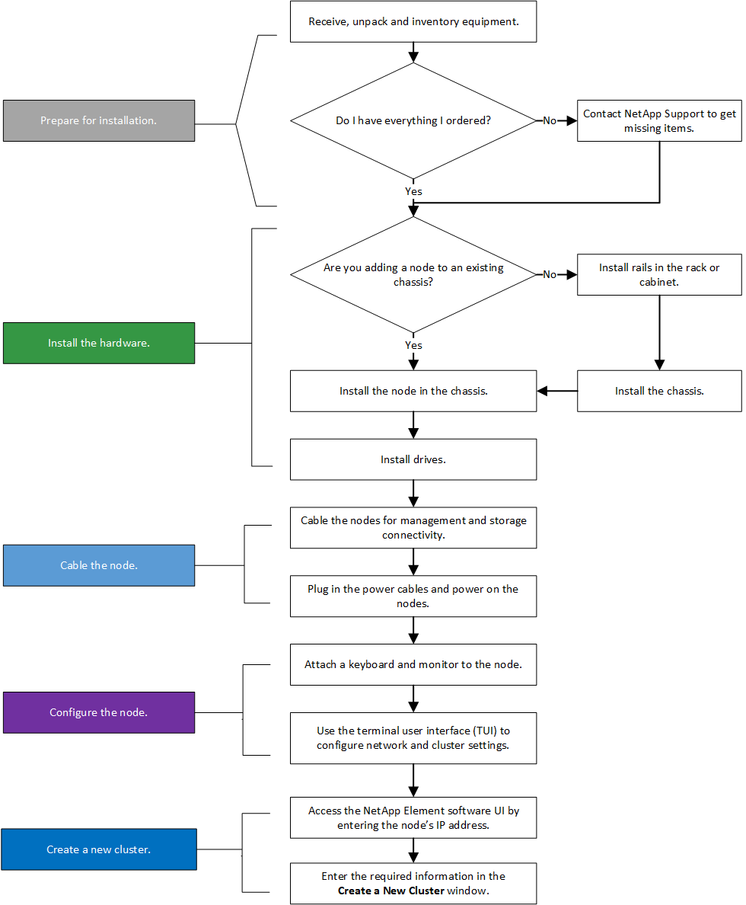
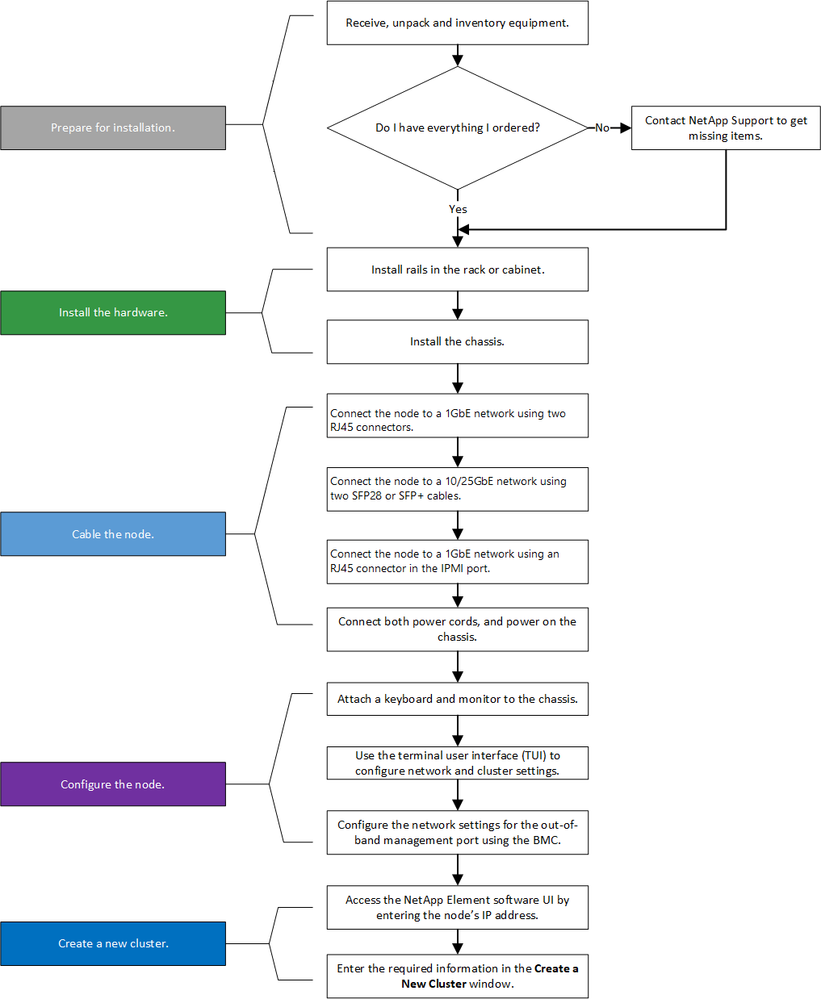
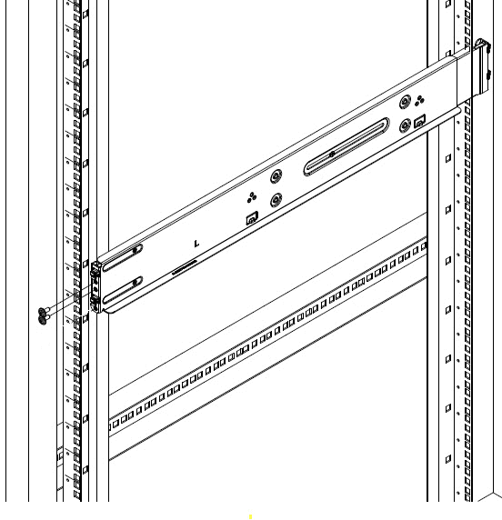
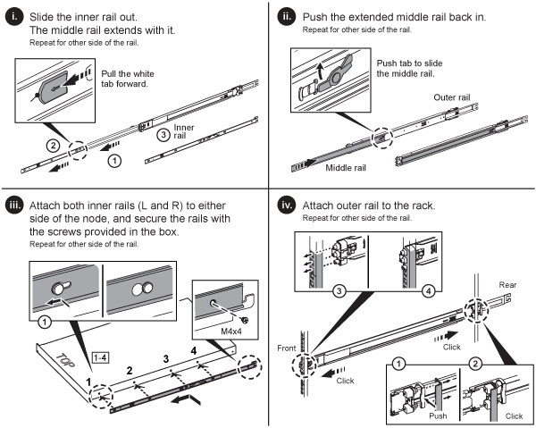
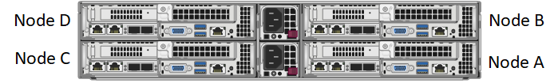
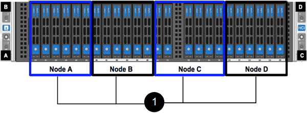
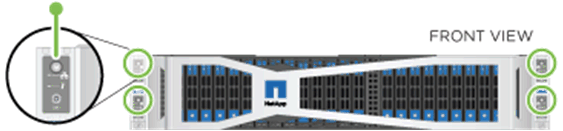
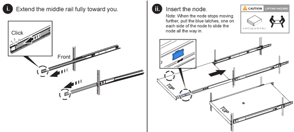
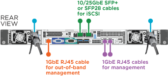
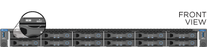

= Installer des nœuds de stockage de la série H
:allow-uri-read: 
:icons: font
:imagesdir: ../media/

[role="lead"]
Avant de commencer la mise en service de votre système de stockage 100 % flash, vous devez installer et configurer correctement les nœuds de stockage.

TIP: Voir lelink:../media/hseries_isi.pdf["affiche"^] pour une représentation visuelle des instructions.

* <<Diagrammes de flux de travail>>
* <<Préparer l'installation>>
* <<Installer les rails>>
* <<Installer et câbler les nœuds>>
* <<Configurer les nœuds>>
* <<Créer un cluster>>

== Diagrammes de flux de travail

Les diagrammes de flux de travail présentés ici offrent une vue d'ensemble des étapes d'installation.  Les étapes varient légèrement selon le modèle de la série H.

=== H410S

=== H610S

NOTE: Les termes « nœud » et « châssis » sont utilisés de manière interchangeable dans le cas du H610S, car le nœud et le châssis ne sont pas des composants séparés, contrairement au cas d'un châssis 2U à quatre nœuds.

== Préparer l'installation

Avant l'installation, veuillez inventorier le matériel qui vous a été expédié et contacter le support NetApp si des éléments sont manquants.

Assurez-vous de disposer des éléments suivants sur votre lieu d'installation :

* Espace rack pour le système.

[cols="2*"]
|===
| Type de nœud | espace rack 

| Nœuds H410S | Deux unités de rack (2U) 

| Nœuds H610S | Une unité de rack (1U) 
|===
* Câbles ou émetteurs-récepteurs à connexion directe SFP28/SFP+
* Câbles CAT5e ou supérieurs avec connecteur RJ45
* Un commutateur clavier, vidéo, souris (KVM) pour configurer votre système
* Clé USB (en option)

TIP: Le matériel qui vous sera expédié dépend de votre commande.  Une nouvelle commande de 2U à quatre nœuds comprend le châssis, le panneau avant, le kit de rails coulissants, les disques, les nœuds de stockage et les câbles d'alimentation (deux par châssis).  Si vous commandez des nœuds de stockage H610S, les disques sont livrés installés dans le châssis.

CAUTION: Lors de l'installation du matériel, veillez à retirer tous les matériaux d'emballage et les films protecteurs de l'appareil.  Cela empêchera les nœuds de surchauffer et de s'arrêter.

== Installer les rails

La commande de matériel qui vous a été expédiée comprend un ensemble de rails de guidage.  Vous aurez besoin d'un tournevis pour terminer l'installation du rail.  Les étapes d'installation varient légèrement selon le modèle de nœud.

TIP: Installez les fixations du bas vers le haut du rack pour empêcher l'équipement de basculer.  Si votre rack comprend des dispositifs de stabilisation, installez-les avant d'installer le matériel.

* <<H410S>>
* <<H610S>>

=== H410S

Les nœuds H410S sont installés dans un châssis H-Series 2U à quatre nœuds, livré avec deux jeux d'adaptateurs.  Si vous souhaitez installer le châssis dans un rack avec des trous ronds, utilisez les adaptateurs appropriés pour un rack avec des trous ronds.  Les rails pour les nœuds H410S s'adaptent à un rack d'une profondeur comprise entre 29 et 33,5 pouces.  Lorsque le rail est complètement rétracté, il mesure 28 pouces de long, et les sections avant et arrière du rail sont maintenues ensemble par une seule vis.

CAUTION: Si vous installez le châssis sur un rail entièrement contracté, les sections avant et arrière du rail risquent de se séparer.

.Étapes
. Alignez l'avant du rail avec les trous du montant avant du porte-bagages.
. Enfoncez les crochets situés à l'avant du rail dans les trous du montant avant du support, puis abaissez-les jusqu'à ce que les chevilles à ressort s'enclenchent dans les trous du support.
. Fixez le rail au support à l'aide de vis.  Voici une illustration du rail gauche fixé à l'avant du rack :
+

. Prolongez la partie arrière du rail jusqu'au montant arrière du porte-bagages.
. Alignez les crochets situés à l'arrière du rail avec les trous correspondants du poteau arrière, en veillant à ce que l'avant et l'arrière du rail soient au même niveau.
. Fixez l'arrière du rail sur le support et fixez-le à l'aide de vis.
. Répétez toutes les étapes ci-dessus pour l'autre côté du support.

=== H610S

Voici une illustration pour l'installation des rails d'un nœud de stockage H610S :

TIP: Le H610S possède des rails gauche et droit.  Positionnez le trou de vis vers le bas afin que la vis moletée H610S puisse fixer le châssis au rail.

== Installer et câbler les nœuds

Vous installez le nœud de stockage H410S dans un châssis 2U à quatre nœuds.  Pour le H610S, installez le châssis/nœud directement sur les rails du rack.

CAUTION: Retirez tous les matériaux d'emballage et le papier d'emballage de l'appareil.  Cela empêche les nœuds de surchauffer et de s'arrêter.

* <<H410S>>
* <<H610S>>

=== H410S

.Étapes
. Installez les nœuds H410S dans le châssis.  Voici un exemple de vue arrière d'un châssis avec quatre nœuds installés :
+

+

WARNING: Faites preuve de prudence lors du levage et de l'installation des pièces dans le rack.  Un châssis vide de deux unités de rack (2U) à quatre nœuds pèse 54,45 lb (24,7 kg) et un nœud pèse 8,0 lb (3,6 kg).

. Installez les disques.
+

. Câblez les nœuds.
+

IMPORTANT: Si les orifices de ventilation situés à l'arrière du châssis sont obstrués par des câbles ou des étiquettes, cela peut entraîner une défaillance prématurée des composants due à une surchauffe.

+
image::../media/hci_isi_storage_cabling.png[Cette figure illustre le câblage d'un nœud de stockage H410S.]

+
** Connectez deux câbles CAT5e ou supérieurs aux ports A et B pour la connectivité de gestion.
** Connectez deux câbles ou émetteurs-récepteurs SFP28/SFP+ aux ports C et D pour la connectivité de stockage.
** (Optionnel, recommandé) connectez un câble CAT5e au port IPMI pour la connectivité de gestion hors bande.

. Raccordez les cordons d'alimentation aux deux blocs d'alimentation par châssis et branchez-les sur une prise de courant ou un PDU 240 V.
. Mise sous tension des nœuds.
+

NOTE: Le démarrage du nœud prend environ six minutes.

+

=== H610S

.Étapes
. Installez le châssis H610S.  Voici une illustration pour l'installation du nœud/châssis dans le rack :
+

+

WARNING: Faites preuve de prudence lors du levage et de l'installation des pièces dans le rack.  Un châssis H610S pèse 40,5 lb (18,4 kg).

. Câblez les nœuds.
+

IMPORTANT: Si les orifices de ventilation situés à l'arrière du châssis sont obstrués par des câbles ou des étiquettes, cela peut entraîner une défaillance prématurée des composants due à une surchauffe.

+

+
** Connectez le nœud à un réseau 10/25GbE à l'aide de deux câbles SFP28 ou SFP+.
** Connectez le nœud à un réseau 1GbE à l'aide de deux connecteurs RJ45.
** Connectez le nœud à un réseau 1GbE à l'aide d'un connecteur RJ-45 dans le port IPMI.
** Connectez les deux câbles d'alimentation au nœud.

. Mise sous tension des nœuds.
+

NOTE: Le démarrage du nœud prend environ cinq minutes et trente secondes.

+

== Configurer les nœuds

Une fois le matériel installé et câblé, vous êtes prêt à configurer votre nouvelle ressource de stockage.

.Étapes
. Connectez un clavier et un moniteur au nœud.
. Dans l'interface utilisateur du terminal (TUI) qui s'affiche, configurez les paramètres réseau et de cluster du nœud en utilisant la navigation à l'écran.
+

NOTE: Vous devriez obtenir l'adresse IP du nœud auprès de l'interface utilisateur technologique (TUI).  Vous en aurez besoin lorsque vous ajouterez le nœud à un cluster.  Une fois les paramètres enregistrés, le nœud est en attente et peut être ajouté à un cluster.  Voir <insérer le lien vers la section Configuration>.

. Configurez la gestion hors bande à l'aide du contrôleur de gestion de la carte mère (BMC).  Ces étapes s'appliquent *uniquement aux nœuds H610S*.
+
.. Utilisez un navigateur Web et accédez à l'adresse IP par défaut du BMC : 192.168.0.120
.. Connectez-vous en utilisant *root* comme nom d'utilisateur et *calvin* comme mot de passe.
.. Depuis l'écran de gestion du nœud, accédez à *Paramètres* > *Paramètres réseau* et configurez les paramètres réseau du port de gestion hors bande.

TIP: Voir https://kb.netapp.com/Advice_and_Troubleshooting/Hybrid_Cloud_Infrastructure/NetApp_HCI/How_to_access_BMC_and_change_IP_address_on_H610S["cet article de la base de connaissances (connexion requise)"] .

== Créer un cluster

Après avoir ajouté le nœud de stockage à votre installation et configuré la nouvelle ressource de stockage, vous êtes prêt à créer un nouveau cluster de stockage.

.Étapes
. Depuis un client situé sur le même réseau que le nœud nouvellement configuré, accédez à l'interface utilisateur du logiciel NetApp Element en saisissant l'adresse IP du nœud.
. Saisissez les informations requises dans la fenêtre **Créer un nouveau cluster**. Voir lelink:../setup/concept_setup_overview.html["Aperçu de la configuration"^] pour plus d'informations.

== Trouver plus d'informations

* https://docs.netapp.com/us-en/element-software/index.html["Documentation logicielle SolidFire et Element"]
* https://docs.netapp.com/sfe-122/topic/com.netapp.ndc.sfe-vers/GUID-B1944B0E-B335-4E0B-B9F1-E960BF32AE56.html["Documentation relative aux versions antérieures des produits NetApp SolidFire et Element"^]

