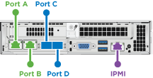
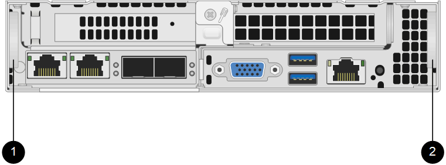

= Remplacer un nœud H410S
:allow-uri-read: 
:icons: font
:imagesdir: ../media/

[role="lead"]
Vous devez remplacer un nœud de stockage en cas de panne du processeur, de problème de carte Radian, d'autres problèmes de carte mère ou s'il ne s'allume pas.  Ces instructions s'appliquent aux nœuds de stockage H410S.

Les alarmes de l'interface utilisateur du logiciel NetApp Element vous avertissent en cas de défaillance d'un nœud de stockage.  Vous devez utiliser l'interface utilisateur Element pour obtenir le numéro de série (étiquette de service) du nœud défaillant.  Vous avez besoin de ces informations pour localiser le nœud défaillant dans le cluster.

Voici l'arrière d'un châssis à deux unités de rack (2U) et quatre nœuds de stockage :

image::hci_stornode_rear.gif[Cette figure illustre le châssis à quatre nœuds avec quatre nœuds de stockage.]

Voici la vue de face d'un châssis à quatre nœuds avec des nœuds H410S, montrant les baies correspondant à chaque nœud :

image::hci_stor_node_ssd_bays.gif[Affiche les baies associées à chaque nœud dans un châssis à quatre nœuds avec des nœuds H410S.]

.Ce dont vous aurez besoin
* Vous avez vérifié que votre nœud de stockage est défectueux et doit être remplacé.
* Vous avez obtenu un nœud de stockage de remplacement.
* Vous avez un bracelet antistatique (ESD) ou vous avez pris d'autres protections antistatiques.
* Vous avez étiqueté chaque câble connecté au nœud de stockage.

Voici un aperçu général des étapes :

* <<Préparez-vous à remplacer le nœud>>
* <<Remplacez le nœud dans le châssis>>
* <<Ajouter le nœud au cluster>>

== Préparez-vous à remplacer le nœud

Vous devez supprimer correctement le nœud de stockage défectueux du cluster dans l'interface utilisateur du logiciel NetApp Element avant d'installer le nœud de remplacement.  Vous pouvez le faire sans provoquer d'interruption de service.  Vous devez obtenir le numéro de série du nœud de stockage défectueux à partir de l'interface utilisateur Element et le faire correspondre au numéro de série figurant sur l'étiquette à l'arrière du nœud.

.Étapes
. Dans l'interface utilisateur d'Element, sélectionnez *Cluster* > *Disques*.
. Retirez les disques du nœud en utilisant l'une des méthodes suivantes :
+
[cols="2*"]
|===
| Option | Étapes 

 a| 
Pour retirer des disques individuels
 a| 
.. Cliquez sur *Actions* pour le lecteur que vous souhaitez supprimer.
.. Cliquez sur *Supprimer*.

 a| 
Pour retirer plusieurs disques
 a| 
.. Sélectionnez tous les disques que vous souhaitez supprimer, puis cliquez sur *Actions groupées*.
.. Cliquez sur *Supprimer*.

|===
. Sélectionnez *Cluster* > *Nœuds*.
. Notez le numéro de série (étiquette de service) du nœud défectueux.  Vous devez le faire correspondre au numéro de série figurant sur l'étiquette à l'arrière du nœud.
. Après avoir noté le numéro de série, retirez le nœud du cluster comme suit :
+
.. Sélectionnez le bouton *Actions* pour le nœud que vous souhaitez supprimer.
.. Sélectionnez *Supprimer*.

== Remplacez le nœud dans le châssis

Après avoir retiré le nœud défectueux du cluster à l'aide de l'interface utilisateur du logiciel NetApp Element , vous êtes prêt à retirer physiquement le nœud du châssis.  Vous devez installer le nœud de remplacement dans le même emplacement du châssis que celui d'où vous avez retiré le nœud défectueux.

.Étapes
. Portez une protection antistatique avant de continuer.
. Déballez le nouveau nœud de stockage et placez-le sur une surface plane près du châssis.
+
Conservez l'emballage pour le moment où vous renverrez le nœud défectueux à NetApp.

. Étiquetez chaque câble inséré à l'arrière du nœud de stockage que vous souhaitez retirer.
+
Après avoir installé le nouveau nœud de stockage, vous devez insérer les câbles dans les ports d'origine.

+
Voici une image montrant l'arrière d'un nœud de stockage :

+

+
[cols="2*"]
|===
| Port | Détails 

 a| 
Port A
 a| 
Port RJ45 1/10 GbE

 a| 
Port B
 a| 
Port RJ45 1/10 GbE

 a| 
Port C
 a| 
Port SFP+ ou SFP28 10/25GbE

 a| 
Port D
 a| 
Port SFP+ ou SFP28 10/25GbE

 a| 
IPMI
 a| 
Port RJ45 1/10 GbE

|===
. Débranchez tous les câbles du nœud de stockage.
. Tirez vers le bas la poignée à came située sur le côté droit du nœud, puis retirez le nœud en utilisant les deux poignées à came.
+
La poignée à came que vous tirez vers le bas comporte une flèche indiquant le sens de son mouvement.  L'autre poignée de came ne bouge pas et sert à vous aider à extraire le nœud.

+

+
[cols="2*"]
|===
| Article | Description 

 a| 
1
 a| 
Poignée à came pour faciliter l'extraction du nœud.

 a| 
2
 a| 
Poignée à came que vous tirez vers le bas avant de retirer le nœud.

|===
+

NOTE: Soutenez le nœud avec vos deux mains lorsque vous le retirez du châssis.

. Placez le nœud sur une surface plane.
+
Vous devez emballer le nœud et le renvoyer à NetApp.

. Installez le nœud de remplacement dans le même emplacement du châssis.
+

IMPORTANT: Veillez à ne pas exercer une force excessive lors de l'insertion du nœud dans le châssis.

. Déplacez les disques du nœud que vous avez retiré et insérez-les dans le nouveau nœud.
. Rebranchez les câbles aux ports auxquels vous les aviez initialement débranchés.
+
Les étiquettes qui figuraient sur les câbles au moment de leur déconnexion vous seront utiles.

+
[NOTE]
====
.. Si les orifices de ventilation situés à l'arrière du châssis sont obstrués par des câbles ou des étiquettes, cela peut entraîner une défaillance prématurée des composants due à une surchauffe.
.. N’insérez pas les câbles de force dans les ports ; vous risqueriez d’endommager les câbles, les ports, ou les deux.

====
+

TIP: Assurez-vous que le nœud de remplacement est câblé de la même manière que les autres nœuds du châssis.

. Appuyez sur le bouton situé à l'avant du nœud pour l'allumer.

== Ajouter le nœud au cluster

Lorsque vous ajoutez un nœud au cluster ou installez de nouveaux disques dans un nœud existant, les disques sont automatiquement enregistrés comme disponibles.  Vous devez ajouter les disques au cluster en utilisant soit l'interface utilisateur Element, soit l'API avant qu'ils puissent participer au cluster.

La version du logiciel sur chaque nœud d'un cluster doit être compatible.  Lorsque vous ajoutez un nœud à un cluster, celui-ci installe la version cluster du logiciel Element sur le nouveau nœud, selon les besoins.

.Étapes
. Sélectionnez *Cluster* > *Nœuds*.
. Sélectionnez *En attente* pour afficher la liste des nœuds en attente.
. Effectuez l’une des opérations suivantes :
+
** Pour ajouter des nœuds individuels, sélectionnez l'icône *Actions* du nœud que vous souhaitez ajouter.
** Pour ajouter plusieurs nœuds, cochez la case des nœuds à ajouter, puis cliquez sur *Actions groupées*.
+

NOTE: Si le nœud que vous ajoutez possède une version du logiciel Element différente de celle exécutée sur le cluster, ce dernier met à jour le nœud de manière asynchrone vers la version du logiciel Element exécutée sur le nœud maître du cluster.  Une fois le nœud mis à jour, il s'ajoute automatiquement au cluster.  Durant ce processus asynchrone, le nœud sera dans un `pendingActive` État.

. Sélectionnez *Ajouter*.
+
Le nœud apparaît dans la liste des nœuds actifs.

. Dans l'interface utilisateur d'Element, sélectionnez *Cluster* > *Disques*.
. Sélectionnez *Disponible* pour afficher la liste des lecteurs disponibles.
. Effectuez l’une des opérations suivantes :
+
** Pour ajouter des disques individuels, sélectionnez l'icône *Actions* du disque que vous souhaitez ajouter, puis sélectionnez *Ajouter*.
** Pour ajouter plusieurs disques, cochez les cases des disques à ajouter, sélectionnez *Actions groupées*, puis *Ajouter*.

== Trouver plus d'informations

* https://docs.netapp.com/us-en/element-software/index.html["Documentation logicielle SolidFire et Element"]
* https://docs.netapp.com/sfe-122/topic/com.netapp.ndc.sfe-vers/GUID-B1944B0E-B335-4E0B-B9F1-E960BF32AE56.html["Documentation relative aux versions antérieures des produits NetApp SolidFire et Element"^]

