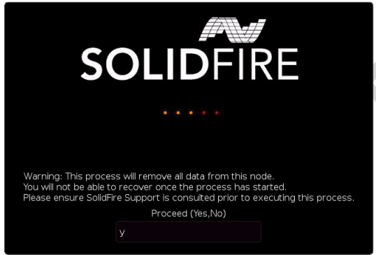

= Le processus RTFI
:allow-uri-read: 
:icons: font
:imagesdir: ../media/

[role="lead"]
Vous pouvez démarrer le processus de retour à l'image d'usine (RTFI) en interagissant avec le nœud via les invites de la console de texte qui apparaissent avant le démarrage du système.

WARNING: Le processus RTFI est destructeur de données et efface de manière sécurisée toutes les données et les détails de configuration du nœud, puis installe un nouveau système d'exploitation.  Vérifiez que le nœud utilisé pour le processus RTFI n'est pas actif au sein d'un cluster.

Le processus RTFI effectue les opérations de haut niveau suivantes :

. L'installation démarre après confirmation de l'utilisateur et valide l'image.
. Déverrouille tous les lecteurs d'un nœud.
. Valide et met à jour le firmware.
. Vérifie le matériel.
. Teste le matériel.
. Effacement sécurisé de tous les lecteurs sélectionnés.
. Partitionne le lecteur racine et crée des systèmes de fichiers.
. Monte et déballe l'image.
. Configure le nom d'hôte, le réseau (Dynamic Host Configuration Protocol), la configuration par défaut du cluster et le chargeur de démarrage GRUB.
. Arrête tous les services, collecte les journaux et redémarre.

Pour configurer votre nœud une fois le processus RTFI terminé avec succès, consultez la section suivante : https://docs.netapp.com/us-en/element-software/index.html["documentation relative à votre version du logiciel Element"^] .  Une fois qu'un nœud a terminé avec succès le processus RTFI, il passe par défaut à l'état _disponible_ (non configuré).

== Effectuez le processus RTFI

Utilisez la procédure suivante pour restaurer le logiciel Element sur votre nœud SolidFire .

Pour plus d'informations sur la création d'une clé USB ou l'utilisation du BMC pour effectuer le processus RTFI, consultezxref:task_rtfi_deployment_and_install_options.adoc[options de déploiement et d'installation de RTFI] .

.Avant de commencer
Vérifiez que vous remplissez les conditions suivantes :

* Vous avez accès à une console pour le nœud SolidFire .
* Le nœud sur lequel vous effectuez le processus RTFI est allumé et connecté à un réseau.
* Le nœud sur lequel vous exécutez le processus RTFI ne fait pas partie d'un cluster actif.
* Vous avez accès à un support d'installation amorçable contenant l'image de la version du logiciel Element correspondant à votre configuration.

Contactez le support NetApp si vous avez des questions avant d'effectuer la procédure RTFI.

.Étapes
. Connectez un moniteur et un clavier à l'arrière du nœud, ou connectez-vous à l'interface utilisateur IP du BMC et affichez la console *iKVM/HTML5* à partir de l'onglet *Contrôle à distance* de l'interface utilisateur.
. Insérez une clé USB contenant une image appropriée dans l'un des deux emplacements USB situés à l'arrière du nœud.
. Mettez le nœud sous tension ou réinitialisez-le.  Au démarrage, sélectionnez le périphérique de démarrage en appuyant sur *F11* :
+

NOTE: Vous devez appuyer plusieurs fois rapidement sur *F11* car l'écran du périphérique de démarrage défile rapidement.

. Dans le menu de sélection du périphérique de démarrage, sélectionnez l'option USB.
+
Les options qui s'affichent dépendent de la marque de la clé USB que vous utilisez.

+
[NOTE]
====
Si aucun périphérique USB n'est répertorié, accédez au BIOS, vérifiez que le périphérique USB figure dans l'ordre de démarrage, redémarrez et réessayez.

Si cela ne résout pas le problème, accédez au BIOS, allez dans l'onglet *Enregistrer et quitter*, sélectionnez *Restaurer les paramètres par défaut optimisés*, acceptez et enregistrez les paramètres, puis redémarrez.

====
. Une liste des images présentes sur le périphérique USB sélectionné s'affiche.  Sélectionnez la version souhaitée et appuyez sur Entrée pour démarrer le processus RTFI.
+
Le nom et le numéro de version du logiciel RTFI image Element apparaissent.

. Lors du premier message, vous êtes averti que le processus supprimera toutes les données du nœud et que ces données ne seront pas récupérables une fois le processus lancé.  Saisissez *Oui* pour commencer.
+

WARNING: Toutes les données et les détails de configuration sont définitivement effacés du nœud après le lancement du processus.  Si vous choisissez de ne pas poursuivre, vous serez redirigé vers la page suivante :xref:task_rtfi_options_menu.html[menu des options RTFI] .

+

NOTE: Si vous souhaitez observer la console pendant le processus RTFI, vous pouvez appuyer sur les touches *ALT+F8* pour basculer vers le mode console détaillé.  Appuyez sur *ALT+F7* pour revenir à l'interface graphique principale.

. Saisissez *Non* lorsque vous êtes invité à effectuer des tests matériels approfondis, sauf si vous avez des raisons de soupçonner une panne matérielle ou si le support NetApp vous demande d'effectuer ces tests.
+
Un message indique que le processus RTFI est terminé et que le système s'éteint.

. Si nécessaire, retirez tous les supports d'installation amorçables après la mise hors tension du nœud.
+
Le nœud est maintenant prêt à être mis sous tension et configuré.  Voir le https://docs.netapp.com/us-en/element-software/setup/concept_setup_overview.html["Documentation de configuration du stockage du logiciel Element"^] pour configurer le nœud de stockage.

+
Si vous avez rencontré un message d'erreur lors du processus RTFI, consultezxref:task_rtfi_options_menu.html[menu des options RTFI] .

== Trouver plus d'informations

* https://docs.netapp.com/us-en/element-software/index.html["Documentation logicielle SolidFire et Element"]
* https://docs.netapp.com/sfe-122/topic/com.netapp.ndc.sfe-vers/GUID-B1944B0E-B335-4E0B-B9F1-E960BF32AE56.html["Documentation relative aux versions antérieures des produits NetApp SolidFire et Element"^]

