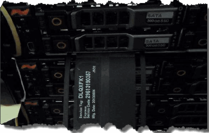

= Remplacer un châssis
:allow-uri-read: 
:icons: font
:imagesdir: ../media/

[role="lead"]
Vous pourriez devoir remplacer le châssis si le ventilateur, l'unité centrale de traitement (CPU) ou le module de mémoire double en ligne (DIMM) tombe en panne, ou pour résoudre des problèmes de surchauffe ou des problèmes liés au processus de démarrage.  Les défauts de cluster dans l'interface utilisateur (UI) du logiciel NetApp Element et le voyant orange clignotant à l'avant du châssis indiquent un besoin possible de remplacement du châssis.  Vous devriez contacter le support NetApp avant de continuer.

.Ce dont vous aurez besoin
* Vous avez contacté le support NetApp .
+
Si vous commandez un remplacement, vous devez ouvrir un ticket auprès du support NetApp .

* Vous avez obtenu le châssis de remplacement.
* Vous avez un bracelet antistatique (ESD) ou vous avez pris d'autres protections antistatiques.
* Si vous devez effectuer la procédure de restauration à l'image d'usine (RTFI), vous avez obtenu la clé USB.
+
L'assistance NetApp vous aidera à déterminer si l'interface RTFI est nécessaire. Voir https://kb.netapp.com/Advice_and_Troubleshooting/Hybrid_Cloud_Infrastructure/NetApp_HCI/How_to_create_an_RTFI_key_to_re-image_a_SolidFire_storage_node["cet article de la base de connaissances (connexion requise)"] .

* Vous avez un clavier et un écran.

.À propos de cette tâche
Les instructions de ce document s'appliquent si vous disposez d'un châssis à une unité de rack (1U) avec l'un des nœuds suivants :

* SF2405
* SF4805
* SF9605
* SF9608
* SF19210
* SF38410
* SF-FCN-01
* FC0025

[NOTE]
====
Selon votre version du logiciel Element, les nœuds suivants ne sont pas pris en charge :

* À commencer par les nœuds de stockage Element 12.8, SF4805, SF9605, SF19210 et SF38410.
* À commencer par l'élément 12.7, les nœuds de stockage SF2405 et SF9608 et les nœuds FC FC0025 et SF-FCN-01.
* À partir des nœuds de stockage Element 12.0, SF3010, SF6010 et SF9010.

====
.Étapes
. Repérez l'étiquette de service du châssis défectueux et vérifiez que le numéro de série correspond à celui figurant sur le dossier que vous avez ouvert auprès du support NetApp lors de votre commande de remplacement.
+
L'étiquette de service se trouve à l'avant du châssis.

+
La figure suivante est un exemple d'étiquette de service :

+

+

NOTE: La figure ci-dessus en est un exemple.  L'emplacement exact de l'étiquette de service peut varier en fonction du modèle de votre matériel.

. Branchez le clavier et le moniteur à l'arrière du châssis défectueux.
. Vérifiez les informations du châssis auprès du support NetApp .
. Mettez le châssis hors tension.
. Étiquetez les disques durs à l'avant du châssis et les câbles à l'arrière.
+

NOTE: Les nœuds Fibre Channel ne possèdent pas de disques durs en façade.

. Retirez les blocs d'alimentation et les câbles.
. Retirez les disques avec précaution et placez-les sur une surface plane et antistatique.
+

NOTE: Si vous disposez d'un nœud Fibre Channel, vous pouvez ignorer cette étape.

. Retirez le châssis en appuyant sur le loquet ou en dévissant la vis moletée, selon le modèle de votre matériel.
+
Vous devez emballer et renvoyer le châssis défectueux à NetApp.

. *Facultatif* : Retirez les rails et installez les nouveaux rails fournis avec votre châssis de remplacement.
+
Vous pouvez choisir de réutiliser les rails existants.  Si vous réutilisez les rails existants, vous pouvez ignorer cette étape.

. Glissez le châssis de remplacement sur les rails.
. Pour les nœuds de stockage, insérez les disques du châssis défaillant dans le châssis de remplacement.
+

NOTE: Vous devez insérer les disques dans les mêmes emplacements que ceux qu'ils occupaient dans le châssis défectueux.

. Installez les blocs d'alimentation.
. Insérez les câbles d'alimentation et les câbles 1GbE et 10GbE dans leurs ports d'origine.
+
Des émetteurs-récepteurs enfichables à petit facteur de forme (SFP) peuvent être insérés dans les ports 10GbE du châssis de remplacement.  Vous devez les retirer avant de câbler les ports 10GbE.

. Si vous avez déterminé que vous n'avez pas besoin d'effectuer le processus RTFI sur le nœud, démarrez le nœud et attendez que l'interface utilisateur du terminal (TUI) apparaisse.  Passez à l'étape 16 et laissez le cluster réinstaller automatiquement l'image du nœud lorsque vous l'ajoutez via l'interface utilisateur.
. *Facultatif* : Si le support NetApp recommande de réinstaller l’image système du nœud à l’aide d’une clé USB, procédez comme suit :
+
.. Alimentation du châssis.  Il démarre avec l'image clé RTFI.
.. À la première invite, tapez *Y* pour créer une image du nœud de stockage.
.. À la deuxième invite, tapez *N* pour les vérifications de l'état du matériel.
+
Si le script RTFI détecte un problème avec un composant matériel, il affiche une erreur dans la console.  Si vous constatez une erreur, contactez l'assistance NetApp .  Une fois le processus RTFI terminé, le nœud s'arrête.

.. Retirez la clé USB de son emplacement.
.. Démarrez le nœud nouvellement configuré et attendez que l'interface utilisateur en mode texte apparaisse.

. Configurez les informations réseau et cluster depuis l'interface utilisateur graphique.
+
Vous pouvez contacter le support NetApp pour obtenir de l'aide.

. Ajoutez le nouveau nœud au cluster à l'aide de l'interface utilisateur du cluster.
. Emballez et renvoyez le châssis défectueux.

== Trouver plus d'informations

* https://docs.netapp.com/us-en/element-software/index.html["Documentation logicielle SolidFire et Element"]
* https://docs.netapp.com/sfe-122/topic/com.netapp.ndc.sfe-vers/GUID-B1944B0E-B335-4E0B-B9F1-E960BF32AE56.html["Documentation relative aux versions antérieures des produits NetApp SolidFire et Element"^]

