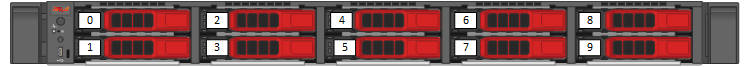
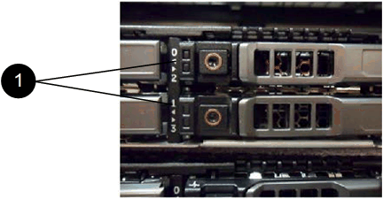

= Remplacer les disques des nœuds de stockage de la série SF
:allow-uri-read: 
:icons: font
:imagesdir: ../media/

[role="lead"]
Vous pouvez remplacer à chaud un disque SSD défectueux par un disque de remplacement.

.Ce dont vous aurez besoin
* Vous disposez d'un disque dur de remplacement.
* Vous portez un bracelet antistatique (ESD) ou vous avez pris d'autres précautions antistatiques.
* Vous avez contacté le support NetApp pour vérifier que le SSD doit être remplacé et pour obtenir de l'aide concernant la procédure de résolution appropriée.
+
Vous aurez besoin de l'étiquette de service ou du numéro de série lorsque vous contacterez l'assistance NetApp .  L'assistance technique vous aidera à obtenir un disque dur de remplacement conformément à votre contrat de niveau de service.

.À propos de cette tâche
Ces instructions s'appliquent aux modèles de nœuds de stockage SolidFire suivants :

* SF2405
* SF4805
* SF9605
* SF9608
* SF19210
* SF38410

[NOTE]
====
Selon votre version du logiciel Element, les nœuds suivants ne sont pas pris en charge :

* À commencer par les nœuds de stockage Element 12.8, SF4805, SF9605, SF19210 et SF38410.
* À partir de l'élément 12.7, nœuds de stockage SF2405 et SF9608.
* À partir des nœuds de stockage Element 12.0, SF3010, SF6010 et SF9010.

====
La figure suivante illustre l'emplacement des disques dans un châssis SF9605 :

NOTE: La figure ci-dessus en est un exemple.  Le SF9608 possède une configuration de lecteurs différente qui ne comprend que huit lecteurs numérotés de un à huit, de gauche à droite.

L'emplacement 0 contient le lecteur de métadonnées du nœud.  Si vous remplacez le disque dur dans l'emplacement 0, vous devez coller l'autocollant inclus dans la boîte d'expédition sur le disque de remplacement, afin de pouvoir l'identifier séparément des autres.

[NOTE]
====
Suivez ces bonnes pratiques lors de la manipulation des disques durs :

* Évitez les décharges électrostatiques (ESD) en gardant le disque dans le sac ESD jusqu'à ce que vous soyez prêt à l'installer.
* N’insérez pas d’outil métallique ou de couteau dans le sac ESD.
* Ouvrez le sachet ESD à la main ou découpez le haut avec des ciseaux.
* Conservez le sachet ESD et tous les matériaux d'emballage au cas où vous devriez renvoyer un disque dur ultérieurement.
* Portez toujours un bracelet antistatique relié à la terre par une surface non peinte de votre châssis.
* Utilisez toujours vos deux mains pour retirer, installer ou transporter un disque dur.
* Ne jamais forcer un disque dur dans le châssis.
* Ne superposez pas les disques durs.
* Utilisez toujours un emballage homologué pour l'expédition de disques.

====
Voici un aperçu général des étapes :

* <<Retirez le disque du cluster>>
* <<Remplacez le disque dur par le châssis.>>
* <<Ajouter le disque au cluster>>

== Retirez le disque du cluster

Le système SolidFire place un disque en état de panne si l'autodiagnostic du disque indique au nœud qu'il est défaillant ou si la communication avec le disque est interrompue pendant cinq minutes et demie ou plus.  Le système affiche la liste des disques défaillants.  Vous devez supprimer un disque défaillant de la liste des disques défaillants dans le logiciel NetApp Element .

.Étapes
. Dans l'interface utilisateur d'Element, sélectionnez *Cluster* > *Disques*.
. Sélectionnez *Échec* pour afficher la liste des disques défaillants.
. Notez le numéro d'emplacement du disque défaillant.
+
Vous avez besoin de ces informations pour localiser le disque défectueux dans le châssis.

. Retirez le disque défaillant en utilisant l'une des méthodes suivantes :
+
[cols="2*"]
|===
| Option | Étapes 

 a| 
Pour retirer des disques individuels
 a| 
.. Sélectionnez *Actions* pour le lecteur que vous souhaitez supprimer.
.. Sélectionnez *Supprimer*.

 a| 
Pour retirer plusieurs disques
 a| 
.. Sélectionnez tous les disques que vous souhaitez retirer, puis sélectionnez *Actions groupées*.
.. Sélectionnez *Supprimer*.

|===

== Remplacez le disque dur par le châssis.

Une fois que vous avez retiré un disque défaillant de la liste des disques défaillants dans l'interface utilisateur d'Element, vous êtes prêt à remplacer physiquement le disque défaillant dans le châssis.

.Étapes
. Déballez le disque de remplacement et placez-le sur une surface plane et antistatique à proximité du rack.
+
Conservez les matériaux d'emballage pour le moment où vous renverrez le disque défectueux à NetApp.

. Faites correspondre le numéro d'emplacement du disque défaillant affiché dans l'interface utilisateur Element avec le numéro figurant sur le châssis.
+
La figure suivante est un exemple illustrant la numérotation des emplacements de disque :

+

+
[cols="2*"]
|===
| Article | Description 

 a| 
1
 a| 
numéros d'emplacement de lecteur

|===
. Appuyez sur le cercle rouge du disque que vous souhaitez retirer pour le libérer.
+
Le loquet s'ouvre d'un clic.

. Faites glisser le disque hors du châssis et placez-le sur une surface plane et exempte d'électricité statique.
. Appuyez sur le cercle rouge du disque de remplacement avant de l'insérer dans son emplacement.
. Insérez le disque de remplacement et appuyez sur le cercle rouge pour fermer le loquet.
. Veuillez informer le support NetApp du remplacement du disque.
+
Le support NetApp vous fournira les instructions pour renvoyer le disque défectueux.

== Ajouter le disque au cluster

Une fois un nouveau disque dur installé dans le châssis, celui-ci est enregistré comme disponible.  Vous devez ajouter le disque au cluster via l'interface utilisateur Element avant qu'il puisse y participer.

.Étapes
. Dans l'interface utilisateur d'Element, cliquez sur *Cluster* > *Disques*.
. Cliquez sur *Disponible* pour afficher la liste des disques disponibles.
. Choisissez l'une des options suivantes pour ajouter des lecteurs :
+
[cols="2*"]
|===
| Option | Étapes 

 a| 
Pour ajouter des disques individuels
 a| 
.. Sélectionnez le bouton *Actions* pour le lecteur que vous souhaitez ajouter.
.. Sélectionnez *Ajouter*.

 a| 
Pour ajouter plusieurs disques
 a| 
.. Sélectionnez les cases à cocher des lecteurs à ajouter, puis sélectionnez *Actions groupées*.
.. Sélectionnez *Ajouter*.

|===

== Trouver plus d'informations

* https://docs.netapp.com/us-en/element-software/index.html["Documentation logicielle SolidFire et Element"]
* https://docs.netapp.com/sfe-122/topic/com.netapp.ndc.sfe-vers/GUID-B1944B0E-B335-4E0B-B9F1-E960BF32AE56.html["Documentation relative aux versions antérieures des produits NetApp SolidFire et Element"^]

