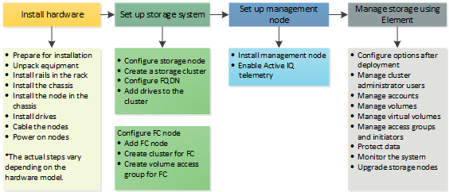

= Découvrez comment configurer le stockage
:allow-uri-read: 
:icons: font
:imagesdir: ../media/

[role="lead"]
À ce stade, vous devriez avoir installé le matériel.  Le matériel inclut également le logiciel Element.

Ensuite, vous devrez configurer le système de stockage adapté à votre environnement.  Vous pouvez configurer un cluster avec des nœuds de stockage ou des nœuds Fibre Channel et le gérer à l'aide du logiciel Element après avoir installé et câblé les nœuds dans une unité rack et les avoir mis sous tension.

.Étapes pour configurer le stockage
. Sélectionnez l'une des options suivantes :
+
** link:../setup/concept_setup_configure_a_storage_node.html["Configurer un cluster avec des nœuds de stockage"]
+
Vous pouvez configurer un cluster avec des nœuds de stockage et le gérer à l'aide du logiciel Element après avoir installé et câblé les nœuds dans une unité rack et les avoir mis sous tension. Vous pouvez ensuite installer et configurer des composants supplémentaires dans votre système de stockage.

** link:../setup/concept_setup_fc_configure_a_fibre_channel_node.html["Configurer un cluster avec des nœuds Fibre Channel"]
+
Vous pouvez configurer un cluster avec des nœuds Fibre Channel et le gérer à l'aide du logiciel Element après avoir installé et câblé les nœuds dans une unité rack et les avoir mis sous tension. Vous pouvez ensuite installer et configurer des composants supplémentaires dans votre système de stockage.

. link:../setup/task_setup_determine_which_solidfire_components_to_install.html["Déterminez les composants SolidFire à installer."]
. link:../setup/task_setup_gh_redirect_set_up_a_management_node.html["Configurez un nœud de gestion et activez la télémétrie Active IQ ."]

== Trouver plus d'informations

* link:../setup/concept_setup_whats_next.html["Découvrez les prochaines étapes pour utiliser le stockage"]
* https://docs.netapp.com/us-en/element-software/index.html["Documentation logicielle SolidFire et Element"]

