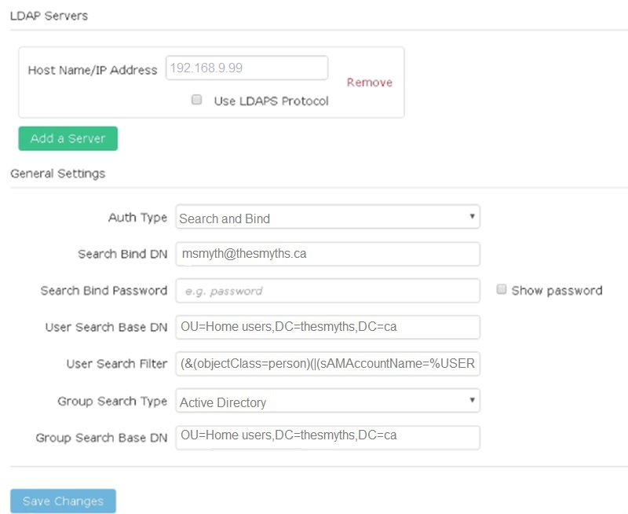
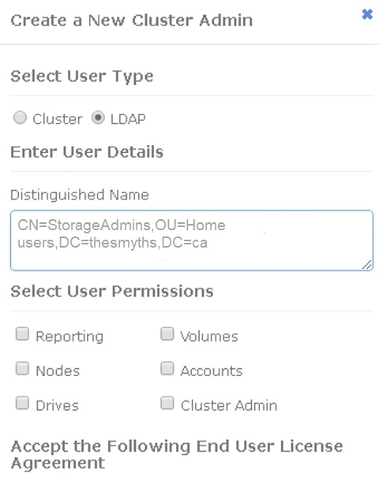

= Gérer les LDAP
:allow-uri-read: 
:icons: font
:imagesdir: ../media/

[role="lead"]
Vous pouvez configurer le protocole LDAP (Lightweight Directory Access Protocol) pour activer une fonctionnalité de connexion sécurisée basée sur un annuaire au stockage SolidFire .  Vous pouvez configurer LDAP au niveau du cluster et autoriser les utilisateurs et les groupes LDAP.

La gestion du protocole LDAP implique la configuration de l'authentification LDAP auprès d'un cluster SolidFire à l'aide d'un environnement Microsoft Active Directory existant et le test de cette configuration.

NOTE: Vous pouvez utiliser les adresses IPv4 et IPv6.

L'activation de LDAP implique les étapes générales suivantes, décrites en détail :

. *Étapes complètes de préconfiguration pour la prise en charge LDAP*.  Vérifiez que vous disposez de toutes les informations nécessaires à la configuration de l'authentification LDAP.
. *Activer l'authentification LDAP*.  Utilisez soit l'interface utilisateur d'Element, soit l'API d'Element.
. *Valider la configuration LDAP*.  Vous pouvez également vérifier que le cluster est configuré avec les valeurs correctes en exécutant la méthode API GetLdapConfiguration ou en vérifiant la configuration LCAP à l'aide de l'interface utilisateur Element.
. *Testez l'authentification LDAP* (avec le `readonly` utilisateur).  Vérifiez que la configuration LDAP est correcte soit en exécutant la méthode API TestLdapAuthentication, soit en utilisant l'interface utilisateur Element.  Pour ce test initial, utilisez le nom d'utilisateur « `sAMAccountName` » du `readonly` utilisateur.  Cela permettra de vérifier que votre cluster est correctement configuré pour l'authentification LDAP et de valider également que le `readonly` Les identifiants et l'accès sont corrects.  Si cette étape échoue, répétez les étapes 1 à 3.
. *Testez l'authentification LDAP* (avec un compte utilisateur que vous souhaitez ajouter).  Répétez l'étape 4 avec un compte utilisateur que vous souhaitez ajouter en tant qu'administrateur du cluster Element.  Copiez le `distinguished` nom (DN) ou l'utilisateur (ou le groupe).  Ce DN sera utilisé à l'étape 6.
. *Ajoutez l'administrateur du cluster LDAP* (copiez et collez le DN de l'étape de test d'authentification LDAP).  Créez un nouvel utilisateur administrateur de cluster avec le niveau d'accès approprié, soit via l'interface utilisateur Element, soit via la méthode API AddLdapClusterAdmin.  Pour le nom d'utilisateur, collez le DN complet que vous avez copié à l'étape 5.  Cela garantit que le DN est correctement formaté.
. *Tester l'accès administrateur du cluster*.  Connectez-vous au cluster en utilisant l'utilisateur administrateur du cluster LDAP nouvellement créé.  Si vous avez ajouté un groupe LDAP, vous pouvez vous connecter en tant que n'importe quel utilisateur appartenant à ce groupe.

== Étapes complètes de préconfiguration pour la prise en charge LDAP

Avant d'activer la prise en charge LDAP dans Element, vous devez configurer un serveur Active Directory Windows et effectuer d'autres tâches de préconfiguration.

.Étapes
. Configurer un serveur Active Directory Windows.
. *Facultatif :* Activer la prise en charge LDAPS.
. Créer des utilisateurs et des groupes.
. Créez un compte de service en lecture seule (tel que « `sfreadonly` ») à utiliser pour la recherche dans l'annuaire LDAP.

== Activez l'authentification LDAP avec l'interface utilisateur Element.

Vous pouvez configurer l'intégration du système de stockage avec un serveur LDAP existant.  Cela permet aux administrateurs LDAP de gérer de manière centralisée l'accès des utilisateurs au système de stockage.

Vous pouvez configurer LDAP soit avec l'interface utilisateur d'Element, soit avec l'API d'Element.  Cette procédure décrit comment configurer LDAP à l'aide de l'interface utilisateur Element.

Cet exemple montre comment configurer l'authentification LDAP sur SolidFire et l'utilise `SearchAndBind` comme type d'authentification.  L'exemple utilise un seul serveur Active Directory Windows Server 2012 R2.

.Étapes
. Cliquez sur *Cluster* > *LDAP*.
. Cliquez sur *Oui* pour activer l'authentification LDAP.
. Cliquez sur *Ajouter un serveur*.
. Saisissez le *nom d'hôte/l'adresse IP*.
+

NOTE: Il est également possible de saisir un numéro de port personnalisé facultatif.

+
Par exemple, pour ajouter un numéro de port personnalisé, saisissez <nom d'hôte ou adresse IP>:<numéro de port>

. *Facultatif :* Sélectionnez *Utiliser le protocole LDAPS*.
. Saisissez les informations requises dans *Paramètres généraux*.
+

. Cliquez sur *Activer LDAP*.
. Cliquez sur *Tester l'authentification de l'utilisateur* si vous souhaitez tester l'accès au serveur pour un utilisateur.
. Copiez le nom distinctif et les informations du groupe d'utilisateurs qui apparaissent pour une utilisation ultérieure lors de la création d'administrateurs de cluster.
. Cliquez sur *Enregistrer les modifications* pour enregistrer les nouveaux paramètres.
. Pour créer un utilisateur dans ce groupe afin que n'importe qui puisse se connecter, veuillez procéder comme suit :
+
.. Cliquez sur *Utilisateur* > *Afficher*.
+

.. Pour le nouvel utilisateur, cliquez sur *LDAP* pour le type d'utilisateur, puis collez le groupe que vous avez copié dans le champ Nom distinctif.
.. Sélectionnez les autorisations, généralement toutes les autorisations.
.. Faites défiler vers le bas jusqu'au Contrat de licence utilisateur final et cliquez sur *J'accepte*.
.. Cliquez sur *Créer un administrateur de cluster*.
+
Vous disposez désormais d'un utilisateur ayant la valeur d'un groupe Active Directory.

Pour tester cela, déconnectez-vous de l'interface utilisateur d'Element et reconnectez-vous en tant qu'utilisateur de ce groupe.

== Activez l'authentification LDAP avec l'API Element

Vous pouvez configurer l'intégration du système de stockage avec un serveur LDAP existant.  Cela permet aux administrateurs LDAP de gérer de manière centralisée l'accès des utilisateurs au système de stockage.

Vous pouvez configurer LDAP soit avec l'interface utilisateur d'Element, soit avec l'API d'Element.  Cette procédure décrit comment configurer LDAP à l'aide de l'API Element.

Pour utiliser l'authentification LDAP sur un cluster SolidFire , vous devez d'abord activer l'authentification LDAP sur le cluster à l'aide de `EnableLdapAuthentication` Méthode API.

.Étapes
. Activez d'abord l'authentification LDAP sur le cluster à l'aide de `EnableLdapAuthentication` Méthode API.
. Veuillez saisir les informations requises.
+
[listing]
----
{
     "method":"EnableLdapAuthentication",
     "params":{
          "authType": "SearchAndBind",
          "groupSearchBaseDN": "dc=prodtest,dc=solidfire,dc=net",
          "groupSearchType": "ActiveDirectory",
          "searchBindDN": "SFReadOnly@prodtest.solidfire.net",
          "searchBindPassword": "ReadOnlyPW",
          "userSearchBaseDN": "dc=prodtest,dc=solidfire,dc=net ",
          "userSearchFilter": "(&(objectClass=person)(sAMAccountName=%USERNAME%))"
          "serverURIs": [
               "ldap://172.27.1.189",
          [
     },
  "id":"1"
}
----
. Modifiez les valeurs des paramètres suivants :
+
[cols="2*"]
|===
| Paramètres utilisés | Description 

 a| 
authType: SearchAndBind
 a| 
Indique que le cluster utilisera le compte de service en lecture seule pour rechercher d'abord l'utilisateur à authentifier, puis pour lier cet utilisateur s'il est trouvé et authentifié.

 a| 
groupSearchBaseDN : dc=prodtest,dc=solidfire,dc=net
 a| 
Spécifie l'emplacement dans l'arborescence LDAP où commencer la recherche de groupes.  Pour cet exemple, nous avons utilisé la racine de notre arbre.  Si votre arborescence LDAP est très volumineuse, vous pouvez envisager de définir une sous-arborescence plus fine afin de réduire les temps de recherche.

 a| 
userSearchBaseDN : dc=prodtest,dc=solidfire,dc=net
 a| 
Spécifie l'emplacement dans l'arborescence LDAP où commencer la recherche des utilisateurs.  Pour cet exemple, nous avons utilisé la racine de notre arbre.  Si votre arborescence LDAP est très volumineuse, vous pouvez envisager de définir une sous-arborescence plus fine afin de réduire les temps de recherche.

 a| 
groupSearchType : ActiveDirectory
 a| 
Utilise le serveur Active Directory Windows comme serveur LDAP.

 a| 
[listing]
----
userSearchFilter:
“(&(objectClass=person)(sAMAccountName=%USERNAME%))”
----
Pour utiliser l'utilisateur principal (adresse e-mail de connexion), vous pouvez modifier l'utilisateurSearchFilter comme suit :

[listing]
----
“(&(objectClass=person)(userPrincipalName=%USERNAME%))”
----
Ou, pour rechercher à la fois userPrincipalName et sAMAccountName, vous pouvez utiliser le filtre userSearchFilter suivant :

[listing]
----
“(&(objectClass=person)(
----| (sAMAccountName=%USERNAME%)(userPrincipalName=%USERNAME%)))” ---- 

 a| 
Utilise le sAMAccountName comme nom d'utilisateur pour se connecter au cluster SolidFire .  Ces paramètres indiquent à LDAP de rechercher le nom d'utilisateur spécifié lors de la connexion dans l'attribut sAMAccountName et limitent également la recherche aux entrées qui ont « personne » comme valeur dans l'attribut objectClass.
 a| 
searchBindDN

 a| 
Il s'agit du nom distinctif de l'utilisateur en lecture seule qui sera utilisé pour effectuer la recherche dans l'annuaire LDAP.  Pour Active Directory, il est généralement plus simple d'utiliser l'identifiant utilisateur principal (format adresse e-mail) pour l'utilisateur.
 a| 
rechercherLierMotDePasse

|===

Pour tester cela, déconnectez-vous de l'interface utilisateur d'Element et reconnectez-vous en tant qu'utilisateur de ce groupe.

== Afficher les détails du LDAP

Consultez les informations LDAP sur la page LDAP, dans l'onglet Cluster.

NOTE: Vous devez activer LDAP pour afficher ces paramètres de configuration LDAP.

. Pour afficher les détails LDAP avec l'interface utilisateur Element, cliquez sur *Cluster* > *LDAP*.
+
** *Nom d'hôte/Adresse IP* : Adresse d'un serveur d'annuaire LDAP ou LDAPS.
** *Type d'authentification* : Méthode d'authentification de l'utilisateur. Valeurs possibles :
+
*** Liaison directe
*** Recherche et liaison

** *DN de liaison de recherche* : DN complet permettant de se connecter pour effectuer une recherche LDAP pour l’utilisateur (nécessite un accès de niveau liaison à l’annuaire LDAP).
** *Mot de passe de liaison de recherche* : Mot de passe utilisé pour authentifier l’accès au serveur LDAP.
** *DN de base de la recherche utilisateur* : Le DN de base de l’arbre utilisé pour démarrer la recherche utilisateur.  Le système effectue une recherche dans le sous-arbre à partir de l'emplacement spécifié.
** *Filtre de recherche utilisateur* : Saisissez ce qui suit en utilisant votre nom de domaine :
+
`(&(objectClass=person)(|(sAMAccountName=%USERNAME%)(userPrincipalName=%USERNAME%)))`

** *Type de recherche de groupe* : Type de recherche qui contrôle le filtre de recherche de groupe par défaut utilisé. Valeurs possibles :
+
*** Active Directory : Appartenance imbriquée à tous les groupes LDAP d’un utilisateur.
*** Pas de groupes : aucun soutien de groupe.
*** Membre DN : Groupes de type Membre DN (à un seul niveau).

** *DN de base pour la recherche de groupe* : Le DN de base de l’arbre utilisé pour démarrer la recherche de groupe.  Le système effectue une recherche dans le sous-arbre à partir de l'emplacement spécifié.
** *Test d'authentification utilisateur* : Une fois LDAP configuré, utilisez cette procédure pour tester l'authentification par nom d'utilisateur et mot de passe du serveur LDAP.  Saisissez un compte existant pour tester ceci.  Le nom distinctif et les informations du groupe d'utilisateurs s'affichent ; vous pouvez les copier pour une utilisation ultérieure lors de la création d'administrateurs de cluster.

== Tester la configuration LDAP

Après avoir configuré LDAP, vous devez le tester en utilisant soit l'interface utilisateur d'Element, soit l'API d'Element. `TestLdapAuthentication` méthode.

.Étapes
. Pour tester la configuration LDAP avec l'interface utilisateur Element, procédez comme suit :
+
.. Cliquez sur *Cluster* > *LDAP*.
.. Cliquez sur *Tester l'authentification LDAP*.
.. Résolvez tout problème en utilisant les informations du tableau ci-dessous :
+
[cols="2*"]
|===
| Message d'erreur | Description 

 a| 
 xLDAPUserNotFound a| 
*** L'utilisateur testé est introuvable dans la configuration. `userSearchBaseDN` sous-arbre.
*** Le `userSearchFilter` est mal configuré.

 a| 
 xLDAPBindFailed (Error: Invalid credentials) a| 
*** Le nom d'utilisateur testé est un utilisateur LDAP valide, mais le mot de passe fourni est incorrect.
*** Le nom d'utilisateur testé est un utilisateur LDAP valide, mais le compte est actuellement désactivé.

 a| 
 xLDAPSearchBindFailed (Error: Can't contact LDAP server) a| 
L'URI du serveur LDAP est incorrect.

 a| 
 xLDAPSearchBindFailed (Error: Invalid credentials) a| 
Le nom d'utilisateur ou le mot de passe en lecture seule est mal configuré.

 a| 
 xLDAPSearchFailed (Error: No such object) a| 
Le `userSearchBaseDN` n'est pas un emplacement valide dans l'arborescence LDAP.

 a| 
 xLDAPSearchFailed (Error: Referral) a| 
*** Le `userSearchBaseDN` n'est pas un emplacement valide dans l'arborescence LDAP.
*** Le `userSearchBaseDN` et `groupSearchBaseDN` sont dans une unité organisationnelle imbriquée.  Cela peut entraîner des problèmes d'autorisation.  La solution de contournement consiste à inclure l'unité organisationnelle dans les entrées DN de base de l'utilisateur et du groupe (par exemple : `ou=storage, cn=company, cn=com` )

|===

. Pour tester la configuration LDAP avec l'API Element, procédez comme suit :
+
.. Appelez la méthode TestLdapAuthentication.
+
[listing]
----
{
  "method":"TestLdapAuthentication",
     "params":{
        "username":"admin1",
        "password":"admin1PASS
      },
      "id": 1
}
----
.. Examinez les résultats.  Si l'appel API réussit, les résultats incluent le nom distinctif de l'utilisateur spécifié et une liste des groupes dont l'utilisateur est membre.
+
[listing]
----
{
"id": 1
     "result": {
         "groups": [
              "CN=StorageMgmt,OU=PTUsers,DC=prodtest,DC=solidfire,DC=net"
         ],
         "userDN": "CN=Admin1 Jones,OU=PTUsers,DC=prodtest,DC=solidfire,DC=net"
     }
}
----

== Désactiver LDAP

Vous pouvez désactiver l'intégration LDAP via l'interface utilisateur d'Element.

Avant de commencer, vous devez noter tous les paramètres de configuration, car la désactivation de LDAP efface tous les paramètres.

.Étapes
. Cliquez sur *Cluster* > *LDAP*.
. Cliquez sur *Non*.
. Cliquez sur *Désactiver LDAP*.

== Trouver plus d'informations

* https://docs.netapp.com/us-en/element-software/index.html["Documentation logicielle SolidFire et Element"]
* https://docs.netapp.com/us-en/vcp/index.html["Module d'extension NetApp Element pour vCenter Server"^]

