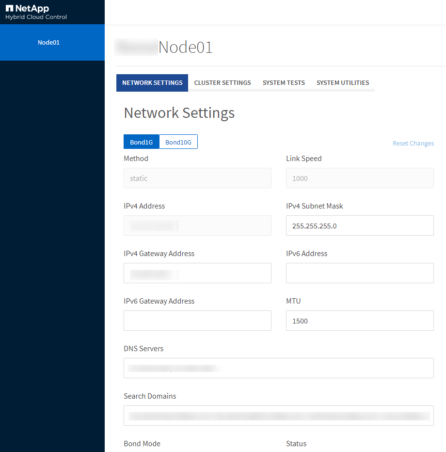

= Accédez aux paramètres par nœud via l'interface utilisateur de chaque nœud.
:allow-uri-read: 
:icons: font
:imagesdir: ../media/

[role="lead"]
Vous pouvez accéder aux paramètres réseau, aux paramètres du cluster, ainsi qu'aux tests et utilitaires système dans l'interface utilisateur de chaque nœud après avoir saisi l'adresse IP du nœud de gestion et vous être authentifié.

Si vous souhaitez modifier les paramètres d'un nœud à l'état Actif faisant partie d'un cluster, vous devez vous connecter en tant qu'administrateur du cluster.

TIP: Vous devez configurer ou modifier un nœud à la fois.  Vous devez vous assurer que les paramètres réseau spécifiés produisent l'effet escompté et que le réseau est stable et fonctionne correctement avant d'apporter des modifications à un autre nœud.

. Ouvrez l'interface utilisateur par nœud en utilisant l'une des méthodes suivantes :
+
** Saisissez l'adresse IP de gestion suivie de :442 dans une fenêtre de navigateur, puis connectez-vous à l'aide d'un nom d'utilisateur et d'un mot de passe d'administrateur.
** Dans l'interface utilisateur d'Element, sélectionnez *Cluster* > *Nœuds*, puis cliquez sur le lien de l'adresse IP de gestion du nœud que vous souhaitez configurer ou modifier.  Dans la fenêtre du navigateur qui s'ouvre, vous pouvez modifier les paramètres du nœud.

+

