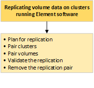

= Effectuez une réplication à distance entre des clusters exécutant le logiciel NetApp Element.
:allow-uri-read: 
:icons: font
:imagesdir: ../media/

[role="lead"]
Pour les clusters exécutant le logiciel Element, la réplication en temps réel permet la création rapide de copies distantes des données de volume.  Vous pouvez associer un cluster de stockage à un maximum de quatre autres clusters de stockage.  Vous pouvez répliquer les données de volume de manière synchrone ou asynchrone à partir de l'un ou l'autre cluster d'une paire de clusters pour les scénarios de basculement et de restauration.

Le processus de réplication comprend les étapes suivantes :

* link:task_replication_plan_cluster_and_volume_pairing.html["Planifier l'association des clusters et des volumes pour la réplication en temps réel"]
* link:task_replication_pair_clusters.html["Apparier les clusters pour la réplication"]
* link:task_replication_pair_volumes.html["Volumes de paires"]
* link:task_replication_validate_volume_replication.html["Valider la réplication du volume"]
* link:task_replication_delete_volume_relationship_after_replication.html["Supprimer une relation de volume après la réplication"]
* link:task_replication_manage_volume_relationships.html["Gérer les relations de volume"]

