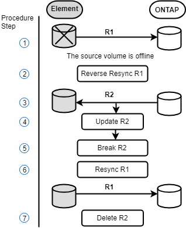
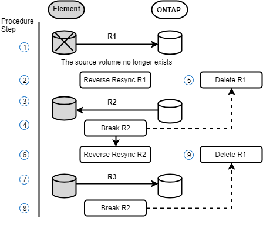

= Découvrez comment effectuer un retour à Element
:allow-uri-read: 
:icons: font
:imagesdir: ../media/

[role="lead"]
Une fois le problème du côté principal résolu, vous devez resynchroniser le volume source d'origine et revenir au logiciel NetApp Element .  Les étapes à suivre varient selon que le volume source d'origine existe toujours ou que vous deviez revenir à un volume nouvellement créé.

== Scénarios de restauration SnapMirror

La fonctionnalité de reprise après sinistre de SnapMirror est illustrée par deux scénarios de restauration.  Ces hypothèses supposent que la relation initiale a été rompue (rupture).

Les étapes des procédures correspondantes sont ajoutées à titre de référence.

NOTE: Dans les exemples présentés ici, R1 = la relation d'origine dans laquelle le cluster exécutant le logiciel NetApp Element est le volume source d'origine (Element) et ONTAP est le volume de destination d'origine (ONTAP).  R2 et R3 représentent les relations inverses créées par l'opération de resynchronisation inverse.

L'image suivante illustre le scénario de retour en arrière lorsque le volume source existe toujours :

L'image suivante illustre le scénario de retour en arrière lorsque le volume source n'existe plus :

== Trouver plus d'informations

* xref:task_snapmirror_perform_failback_when_source_volume_exists.adoc[Effectuer une restauration lorsque le volume source existe toujours.]
* xref:task_snapmirror_performing_failback_when_source_volume_no_longer_exists.adoc[Effectuer une restauration lorsque le volume source n'existe plus.]
* xref:concept_snapmirror_failback_scenarios.adoc[Scénarios de restauration SnapMirror]

